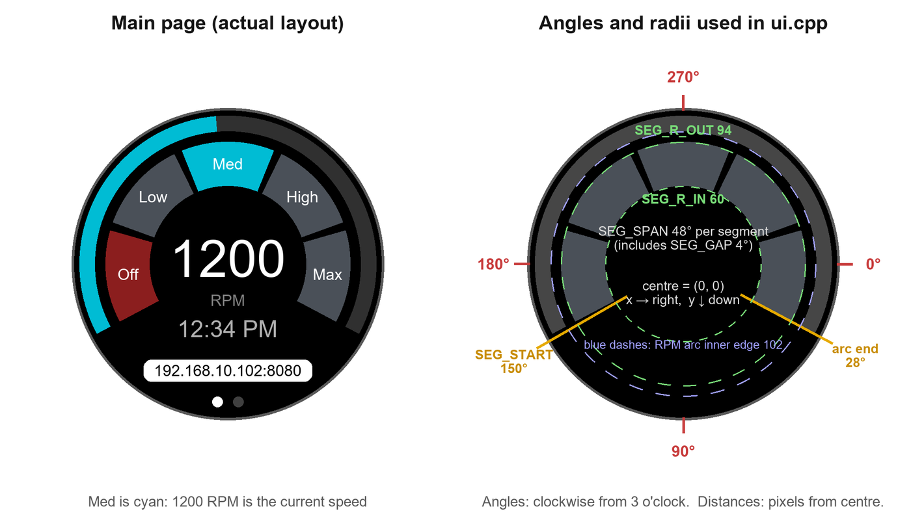

# Display Guide: changing how the knob's screen looks

This guide explains how to change the round LCD: colours, text, buttons, sizes and positions,
and how to add or remove swipe pages. It assumes you can open the project in VS Code with
PlatformIO and press **Upload**. You don't need to know LVGL, the graphics library underneath.



---

## 1. Before you start

### Where things live

| What you want to change | File |
|---|---|
| Almost everything on the screen | `src/ui.cpp` |
| Which font sizes are available | `include/lv_conf.h` |
| Standby brightness, how the screensaver starts and stops | `src/main.cpp` |
| The eye itself, and the list of eye styles | `src/dragon_eye.cpp`, `src/eye_styles.cpp`, `include/eyes/` |

Some things need no code at all. They're on the web page:

| Setting | Web page tab |
|---|---|
| LCD brightness | Home |
| Fan max RPM (top of the arc, knob and all speed controls) | Config → Fan Presets |
| Preset speeds (Low / Med / High / Max) | Config → Fan Presets |
| 12 / 24-hour clock, time zone | Config |
| Screensaver delay (0 = off) | Config → Display & Interface |
| Eye style (Dragon, Cat, Owl, …) | Config → Display & Interface |

### Getting a change onto the screen

1. Edit and save the file.
2. Press **Upload** in PlatformIO with the knob plugged in by USB. It builds and flashes.
   If the upload says the port is busy, close the Serial Monitor first.
3. Or, without USB: press **Build**, then send
   `.pio/build/esp32-s3-devkitc-1/firmware.bin` from the web page's **OTA Update** tab.

If a change breaks something, undo it and upload again. USB upload always works, even if
the screen is blank.

**Tip:** in `ui.cpp`, use **Ctrl+F** to find the names used in this guide (`SEG_R_OUT`,
`create_main_page`, and so on). Line numbers change as the code grows; names don't.

---

## 2. Four basics

### Positions: x and y from the centre

The screen is 240 × 240 pixels, but round: the corners can't be seen. Most things are
placed relative to the **centre** of the screen:

```cpp
lv_obj_align(clock_label, LV_ALIGN_CENTER, 0, 50);
//                                          x   y
```

* **x**: positive moves **right**, negative moves left.
* **y**: positive moves **down**, negative moves up.
* The visible circle has a radius of 120, so keep everything within about 110 of the centre.

Example: to move the clock up 10 pixels, change `50` to `40`.

### Colours

Colours are written as a hex code, like on a web page:

```cpp
lv_color_hex(0x8B1E1E)          // dark red
lv_color_white()                // white
lv_color_black()                // black
lv_palette_main(LV_PALETTE_CYAN)
```

Palette names you can use: `RED`, `PINK`, `PURPLE`, `DEEP_PURPLE`, `INDIGO`, `BLUE`,
`LIGHT_BLUE`, `CYAN`, `TEAL`, `GREEN`, `LIGHT_GREEN`, `LIME`, `YELLOW`, `AMBER`, `ORANGE`,
`DEEP_ORANGE`, `BROWN`, `BLUE_GREY`, `GREY`. Write them as `LV_PALETTE_ORANGE`, etc.

Any colour picker (search "colour picker" in a browser) gives you a hex code like
`#FF8800`. Write it as `0xFF8800`.

### Text size (fonts)

The screen uses the Montserrat font in fixed sizes. These are switched on now:

| Font | Used for |
|---|---|
| `lv_font_montserrat_14` | small text: segment labels, "RPM", IP box, info |
| `lv_font_montserrat_20` | clock, page titles, menu, popups |
| `lv_font_montserrat_40` | the big RPM number |
| `lv_font_montserrat_48` | not shown at the moment (old standby clock) |

To use another size (any even number from 8 to 48), switch it on in `include/lv_conf.h`:

```c
#define LV_FONT_MONTSERRAT_32 1
```

and then use `&lv_font_montserrat_32` in `ui.cpp`. Each size you switch on takes some
firmware space: about 10 KB for small sizes and up to about 60 KB for the largest. There's
plenty of room, but don't switch on sizes you don't use.

### Icons

The built-in fonts include simple icons. Use them inside text:

```cpp
LV_SYMBOL_POWER "\nOff"      // power icon, then "Off" on a second line
```

Other icons include `LV_SYMBOL_SETTINGS`, `LV_SYMBOL_WIFI`, `LV_SYMBOL_HOME`,
`LV_SYMBOL_BELL`, `LV_SYMBOL_OK`, `LV_SYMBOL_CLOSE`, `LV_SYMBOL_PLUS`, `LV_SYMBOL_MINUS`,
`LV_SYMBOL_UP`, `LV_SYMBOL_DOWN`, `LV_SYMBOL_EYE_OPEN`, `LV_SYMBOL_WARNING` and
`LV_SYMBOL_REFRESH`. They only work in the Montserrat fonts above.

---

## 3. The Main page

The Main page is built in `create_main_page()` in `ui.cpp`. The picture at the top shows
each part.

### The five segment buttons (Off, Low, Med, High, Max)

These are the settings near the top of the **QUICK SEGMENTS** section of `ui.cpp`:

```cpp
static const int SEG_COUNT = 5;
static const int SEG_START = 150;   // Left end, just below 9 o'clock
static const int SEG_SPAN = 48;     // Per segment incl. gap
static const int SEG_GAP = 4;
static const int SEG_R_OUT = 94;    // Outer edge of the band
static const int SEG_R_IN = 60;     // Inner edge of the band
```

**Angles** are in degrees, measured **clockwise from 3 o'clock**: 0° is 3 o'clock, 90° is
6 o'clock, 180° is 9 o'clock and 270° is 12 o'clock. The right-hand side of the picture
shows this.

| To... | Change |
|---|---|
| Make the band thicker or thinner | `SEG_R_IN` (smaller = thicker, towards the centre) |
| Move the band in or out | `SEG_R_OUT` and `SEG_R_IN` together. Keep `SEG_R_OUT` at 94 or less, or the segments touch the RPM arc |
| Make the gaps between segments wider | `SEG_GAP` |
| Rotate the whole band | `SEG_START` |
| Make each segment longer or shorter | `SEG_SPAN` (the band covers `SEG_COUNT × SEG_SPAN` degrees; keep it at 240 or less so the bottom stays open for the clock and IP box) |

**The RPM arc follows the band automatically.** Its ends are worked out from these numbers,
so it always ends level with the outer segments.

**Labels:** the text on each segment is in this line:

```cpp
static const char *const seg_text[SEG_COUNT] = {LV_SYMBOL_POWER "\nOff", "Low", "Med", "High", "Max"};
```

`"\n"` starts a new line. The labels use `lv_font_montserrat_14`, set in `create_segments()`.

**Colours** are in `seg_highlight()`:

```cpp
lv_color_t c = lit         ? lv_palette_main(LV_PALETTE_CYAN)   // pressed, or the current speed
             : i == 0      ? lv_color_hex(0x8B1E1E)             // Off: dark red
                           : lv_color_hex(0x4A5058);            // others: steel grey
```

**Speeds:** each segment's speed comes from the preset speeds on the web page (Config →
Fan Presets). Off is always 0. The list is in `seg_rpm()`.

**Adding or removing a segment** means changing three things so they agree:

1. `SEG_COUNT`: the number of segments.
2. `seg_text`: one label per segment.
3. `seg_rpm()`: one speed per segment.

Then adjust `SEG_SPAN` so they still fit (for 6 segments, try `SEG_SPAN = 40`). If you
list more labels or speeds than `SEG_COUNT`, the build fails. If you list fewer, the extra
segments have no label and set 0 RPM (the same as Off).

### The RPM arc (outer ring)

In `create_main_page()`:

| To change | Look for |
|---|---|
| Ring thickness | `lv_obj_set_style_arc_width(rpm_arc, 12, ...)`. There are two lines: track and fill |
| Track colour (unfilled part) | `lv_color_hex(0x303030)` on the `LV_PART_MAIN` line |
| Fill colour | `lv_palette_main(LV_PALETTE_CYAN)` on the `LV_PART_INDICATOR` line |
| Drag knob colour | `lv_color_white()` on the `LV_PART_KNOB` line |
| Overall size | `lv_obj_set_size(rpm_arc, 228, 228)`. If you make it smaller, reduce `SEG_R_OUT` to match |

The arc can be dragged to set the speed. It snaps to the RPM step size set in the config.

### RPM number, "RPM" caption and clock

All three are in `create_main_page()`, one block each:

| Item | Font | Colour | Position (x, y) |
|---|---|---|---|
| RPM number (`rpm_label`) | `montserrat_40` | white | 0, -4 |
| "RPM" caption (`unit_label`) | `montserrat_14` | `0x808080` grey | 0, 28 |
| Clock (`clock_label`) | `montserrat_20` | `0xB0B0B0` light grey | 0, 50 |

**Watch the RPM number's size.** A 4-digit speed at a larger font runs into the Off and Max
segments; that's why it's 40 and not 48.

### IP address box (status box)

In `create_status_box()`: position `0, 82`, white box with black text, corner radius 6.
When the saved WiFi is lost, it flashes red and white every half second. The flash colours
are in `status_flash_cb()`, and the speed (500 ms) is in `lv_timer_create(status_flash_cb, 500, ...)`.

### Page dots

In `create_page_dots()`: 8-pixel dots, 16 pixels apart, 10 pixels up from the bottom.
The current page is white and the others are `0x404040`. There's one dot per page,
added automatically.

### Double-tap popup

Double-tapping empty space on Main stops the fan. The popup text and colours are in
`main_tap_cb()`: `"Fan stopped"` on red, `"Fan is not running"` on grey. The popup's font,
padding and 1.5-second display time are in `show_popup()`. The double-tap window
(400 ms) is in `main_tap_cb()`: `now - last_tap < 400`.

---

## 4. Pages

### How pages work

You swipe left and right between pages. The pages are listed in **one table** near the top
of `ui.cpp`:

```cpp
static const Page PAGES[] = {
  {"Main", create_main_page},
  {"Settings", create_settings_page},
};
```

Each row is a **name** (shown in the knob menu) and a **function that builds the page**.
Everything else follows this table automatically:

* the swipe order (top row is the left-most page)
* the page dots
* the knob menu (short press on the knob)
* tap-empty-space-to-return-to-Main, on every page except Main

**Main must stay first.** Turning the knob and waking up both return to the first page.

### Reordering, renaming or removing a page

* **Reorder:** move the rows.
* **Rename in the menu:** change the name in quotes.
* **Remove:** delete the row. Also delete the page's `create_..._page` function and its
  declaration near the top of the file, or the build warns that it's unused.

### Adding a page: a worked example

This adds an "About" page after Settings.

**Step 1.** Add a declaration next to the others near the top of `ui.cpp`:

```cpp
static void create_settings_page(lv_obj_t *tile);
static void create_about_page(lv_obj_t *tile);      // ← add
```

**Step 2.** Add a row to the table:

```cpp
static const Page PAGES[] = {
  {"Main", create_main_page},
  {"Settings", create_settings_page},
  {"About", create_about_page},                     // ← add
};
```

**Step 3.** Write the page. Put it just after `create_settings_page()`, so it can use the
`page_title()` helper:

```cpp
static void create_about_page(lv_obj_t *tile) {
  page_title(tile, "About");                        // grey title near the top

  lv_obj_t *text = lv_label_create(tile);
  lv_obj_set_style_text_font(text, &lv_font_montserrat_14, 0);
  lv_obj_set_style_text_color(text, lv_color_white(), 0);
  lv_obj_set_style_text_align(text, LV_TEXT_ALIGN_CENTER, 0);
  lv_label_set_text(text, "WiFi Fan Knob\nsergeant82d/Wifi_Fan_Knob");
  lv_obj_align(text, LV_ALIGN_CENTER, 0, 0);
}
```

Upload. There's now a third dot, "About" is in the knob menu, and a tap on the page returns
to Main.

**A button on a new page** looks like this (copy it inside your page function):

```cpp
  lv_obj_t *btn = lv_btn_create(tile);
  lv_obj_set_size(btn, 100, 44);                                  // width, height
  lv_obj_align(btn, LV_ALIGN_CENTER, 0, 50);                      // x, y
  lv_obj_set_style_bg_color(btn, lv_palette_main(LV_PALETTE_GREEN), 0);
  lv_obj_add_event_cb(btn, my_button_cb, LV_EVENT_CLICKED, nullptr);
  lv_obj_t *label = lv_label_create(btn);
  lv_label_set_text(label, "Press me");
  lv_obj_center(label);
```

with what it does written above the page function:

```cpp
static void my_button_cb(lv_event_t *) {
  fan_set_target(1500);   // example: set the fan to 1500 RPM
}
```

### The Settings page

In `create_settings_page()`:
* title at `y = -80`
* brightness label and slider (slider 150 wide, range 10–100 %)
* network and MQTT information at `y = 40`

The information text is written in `update_info()`, once a second.

### The knob menu

In `create_menu()` and `menu_highlight()`:
* The background is black at 90 % opacity (`LV_OPA_90`).
* Each item is 150 × 40 with `montserrat_20` text.
* The selected item is cyan with black text; the others are `0x303030` with white text.

---

## 5. Screensaver and standby

| To change | Where |
|---|---|
| Screensaver delay, or turn it off | Web page → Config → Display & Interface (seconds; 0 = off) |
| Eye style | Web page → Config → Display & Interface |
| Standby brightness (0 = screen off) | Web page → Config → Display & Interface |
| How the eye sleeps in standby (how long it stays shut, twitches, peeks) | `sleep_openness()` in `src/dragon_eye.cpp` |
| Eye speed in standby (15 frames per second) | `STANDBY_EYE_FPS` in `src/main.cpp` |
| What counts as "activity" | `note_activity()` calls in `src/main.cpp` (knob, button, touch, speed changes) |
| The styles on offer, and their order | `EYE_STYLES` in `src/eye_styles.cpp` |

The eye styles come from Adafruit's "Uncanny Eyes". Each one is a data file in
`include/eyes/`, drawn for a 128-pixel screen. When you pick a style, the knob scales it up
to this screen's 240 pixels, so it's smooth but not more detailed than the original art.
To remove a style from the web list, delete its line in `EYE_STYLES`. To add one, copy a
block in `src/eye_styles.cpp` (the file explains how).

The screensaver shows the eye while the fan keeps running. A touch, knob turn or
short press only dismisses it. In standby the eye goes to sleep: it closes, stays shut,
and now and then twitches or peeks. Standby also stops the fan and switches external
power off.

---

## 6. When something goes wrong

| Symptom | Likely cause and fix |
|---|---|
| Build error: `'lv_font_montserrat_32' was not declared` | That font size isn't switched on. Add `#define LV_FONT_MONTSERRAT_32 1` to `include/lv_conf.h` |
| Something doesn't appear | It's outside the visible circle (keep within ~110 of the centre), or something created later is drawn on top of it |
| Taps on a new item do nothing | Something clickable is on top of it. Labels don't take taps; buttons and boxes do |
| Swiping between pages stops working | A large clickable item on the page is catching the swipe. Make it smaller, or make it not clickable: `lv_obj_clear_flag(obj, LV_OBJ_FLAG_CLICKABLE)` |
| Text runs into the segments | Use a smaller font, or move it down (bigger y) |
| Screen blank or rebooting after an upload | Open the Serial Monitor to see the error. Undo the change and upload again by USB |

For anything not covered here, the LVGL 8 documentation is at
<https://docs.lvgl.io/8.4/>. This project uses LVGL **8.4**; examples written for LVGL 9
(including Elecrow's) use different function names.
